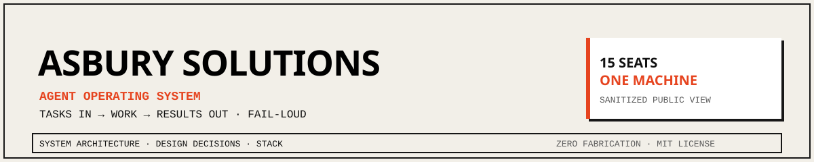
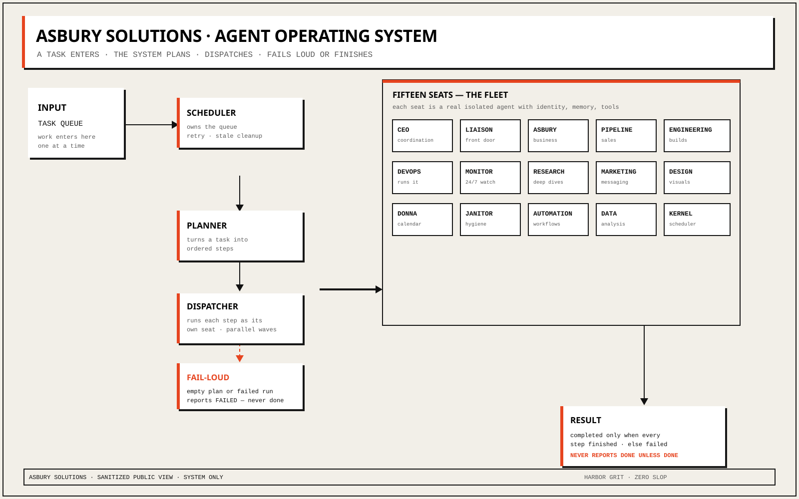

# Asbury Solutions — Agent Operating System



**A single-machine operating system for a 15-seat software company.** Tasks go
in, work happens, results come back — with a scheduler, a dispatcher,
self-healing monitors, and one hard rule: nothing reports done that did not
finish.

> This repository is the public, sanitized view of the system. It shows the
> architecture, the design decisions, and the stack. It does not contain
> credentials, live endpoints, client data, or internal operations details
> (see [docs/sanitization.md](docs/sanitization.md)).

---

## What it is

An operating system for a company that writes code, ships products, answers
customers, and monitors itself — all from one machine. A task arrives, the
scheduler records it in the ledger and hands it to the orchestrator, the
planner breaks it into ordered steps, and each step runs as a real agent
process belonging to one of fifteen specialized seats. The result comes back,
and the ledger keeps the full history — every task, schedule, memory entry,
and alert — not a chat log.

- **A scheduler** that owns the work queue and fires tasks. It ticks on a
  cadence, fires due schedules, retries failures, and clears stale work.
- **A dispatcher** that sends each task to the right seat and runs it as a
  real, isolated process. Leaves are real agent subprocesses, not in-process
  role-play.
- **Fifteen specialized seats** — engineering, research, marketing, design,
  ops, sales, and the rest — each with its own identity, memory, and tools.
  The roster is a single frozen tuple in code, so the planner, dispatcher,
  and name resolution all agree on who exists.
- **A fail-loud contract.** An empty plan or a failed run reports as failed.
  It never reports completed. The verification harness asserts this directly —
  a forced empty plan exits non-zero and the ledger records `failed` (see
  [docs/decisions/0002-fail-loud.md](docs/decisions/0002-fail-loud.md)).

### The fleet — 15 seats

| # | Seat | Persona | Responsibility |
|---|------|---------|----------------|
| 1 | Chief Executive | Ward | Strategy, prioritization, routing, final decisions |
| 2 | Liaison | Eli | External communications — the single front door |
| 3 | Business Ops | Marcus | Proposals, bookkeeping, engagement framing |
| 4 | Sales Pipeline | Vance | Revenue ops, pipeline, forecasting |
| 5 | Engineering | Frank | Full-stack application code |
| 6 | DevOps | Frank | Pipelines, deployment, security, runbooks |
| 7 | Service Health | Argus | Always-on monitoring, watchdog, quality gates |
| 8 | Research | Isidore | Deep multi-source research, citations |
| 9 | Marketing | Homer | Go-to-market, copy, campaigns |
| 10 | Creative Direction | Delacroix | Brand system, visual design, quality bar |
| 11 | Personal Assistant | Donna | Scheduling, personal coordination |
| 12 | Operations | Mop | Hygiene, cleanup, mechanical tasks |
| 13 | Automation | Gage | Workflow graphs, webhooks, non-LLM automation |
| 14 | Data Analytics | Victor | Databases, reporting, analysis |
| 15 | Platform Ops | Halcyon | Kernel, scheduler, task ledger, platform health |

Each seat is a full agent profile — identity, configuration, memory, skills,
and an explicit tool allow-list.

---

## Architecture



The diagram above is the canonical public view. It is drawn to the Harbor Grit
diagram spec ([docs/DIAGRAM_STYLE.md](docs/DIAGRAM_STYLE.md)) — cream paper,
ink rules, one signal accent. Every box is a real component; no box is
decorative.

**Flow (plain words):**

1. A task enters the queue — scheduled, via the API, or by webhook.
2. The planner turns it into ordered steps; each step names a seat, a task,
   and its dependencies.
3. Each step runs as its own seat process — in parallel waves where
   dependencies allow.
4. Results come back; the run is marked completed **only** if every step
   finished. An empty plan or all-steps-failed raises an error, exits
   non-zero, and the ledger records `failed` — never a false `completed`.

Full diagrams, including the kernel internals and the dispatch sequence, live
in [docs/architecture.md](docs/architecture.md).

---

## Stack

| Layer | What runs it |
|-------|--------------|
| Orchestration | Python orchestrator + dispatcher — planner breaks a task into steps, dispatcher launches each step as a real seat subprocess |
| Scheduler / kernel | Flask kernel (threaded) + SQLite task ledger (WAL mode) |
| Seats | 15 Hermes agent profiles — real subprocesses with identity, memory, skills, tool allow-list |
| Runtime | Python 3 · systemd user units · no Docker |
| Integrations | Voice (Twilio Media Streams), storefront payments (Stripe webhooks), edge functions (Cloudflare Workers), managed auth (Clerk) |

Rationale for every choice: [docs/tech-stack.md](docs/tech-stack.md).

---

## Design decisions (decisions-as-code)

1. **Real seats, not role-play** — the leaves of the system are 15 real agent
   subprocesses, each with its own identity, memory, skills, and tools;
   specialist simulation was removed from the runtime.
   ([0001](docs/decisions/0001-real-seats-not-roleplay.md))
2. **Fail loud, never report false success** — an empty plan or zero
   successful steps exits non-zero and is recorded as `failed`; there is no
   path from "nothing ran" to "completed".
   ([0002](docs/decisions/0002-fail-loud.md))
3. **One shared auth source** — all seats resolve their credential from a
   single shared file; no per-seat keys to leak or rotate.
   ([0003](docs/decisions/0003-single-auth-source.md))
4. **Task-appropriate timeouts** — a step is killed if it exceeds its
   resolved timeout (explicit value > environment override > step-type
   default > base default). ([0004](docs/decisions/0004-task-appropriate-timeouts.md))
5. **One orchestrator, not a family of twins** — overlapping swarm
   implementations were consolidated to a single standalone orchestrator, so
   one codebase owns the fleet. ([0005](docs/decisions/0005-one-orchestrator.md))
6. **No Docker for the org runtime** — the system runs natively as systemd
   user units on one Linux host; single-machine by design.
   ([0006](docs/decisions/0006-no-docker-org-runtime.md))

The full log, including the SQLite (WAL) ledger decision
([0007](docs/decisions/0007-sqlite-wal-ledger.md)), is in
[docs/decisions/](docs/decisions/).

---

## Repository map

```
.
├── README.md                 # this file — public overview
├── LICENSE                   # MIT
├── docs/
│   ├── architecture.md       # system + kernel + task-flow diagrams
│   ├── architecture.svg      # canonical system diagram (Harbor Grit)
│   ├── banner.svg            # README hero banner (Harbor Grit)
│   ├── tech-stack.md         # every technology and why
│   ├── sanitization.md       # what is deliberately excluded, and why
│   ├── DIAGRAM_STYLE.md      # Harbor Grit diagram spec
│   └── decisions/            # decisions-as-code (ADR style)
├── diagrams/                 # Mermaid source for architecture diagrams
└── examples/                 # non-secret sample configuration
```

Non-secret sample configuration to learn from: [examples/](examples/).

---

## Contributing

This is a public reference repository for a real operating system. It is not
open to external contributions at this time.

---

## License

MIT — see [LICENSE](LICENSE).

---

**Asbury Solutions** · Built and operated on one machine · Plain words, real
systems, zero fabrication.
