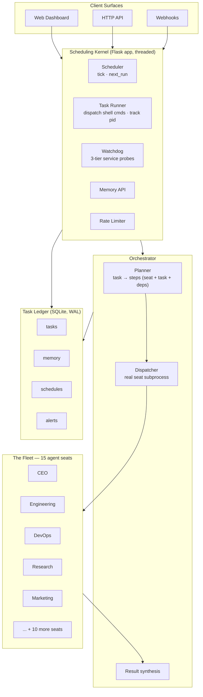
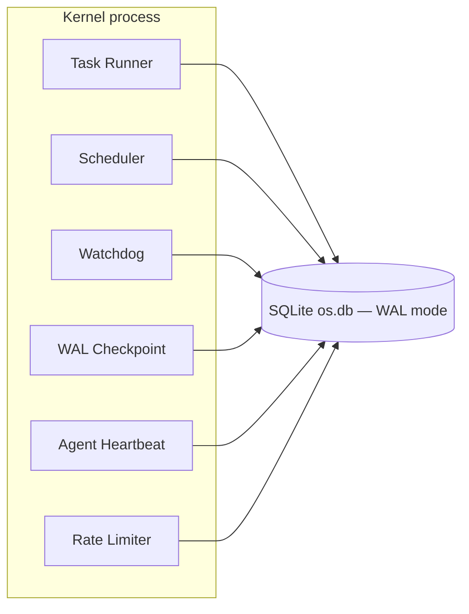
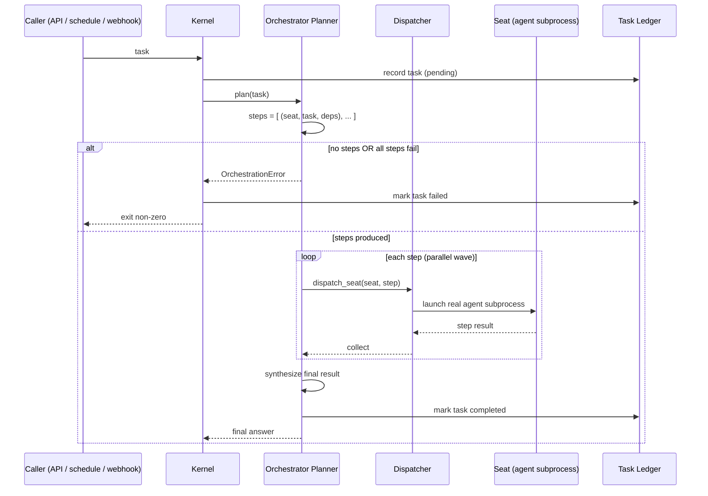
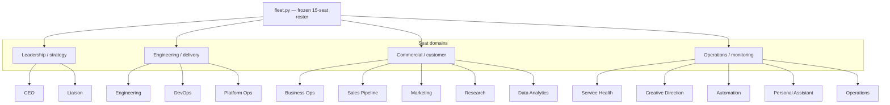

# Architecture

This document describes how the Asbury Solutions autonomous agent
organization is built. All diagrams are Mermaid source (render natively on
GitHub) and are also stored standalone in [`../diagrams/`](../diagrams/).

Everything here describes the **system**. It contains no credentials, no live
endpoints, no ports, no client data, and no internal operational state. See
[`sanitization.md`](sanitization.md) for the boundary.

---

## 1. System overview

The system has four layers: client surfaces, a scheduling kernel, an
orchestrator, and the agent fleet. A durable SQLite ledger sits beneath it all.

---

## 2. Kernel internals

A single threaded application process owns scheduling, task execution, health
monitoring, memory, and rate limiting. It is the hub the fleet runs through.

Background responsibilities:

- **Task Runner** — executes scheduled commands, tracks process groups, and
  records outcomes in the ledger.
- **Scheduler** — ticks on a cadence, fires due schedules, and computes the
  next run time.
- **Watchdog** — probes registered services with per-service latency budgets
  and severity tiers, so a slow service doesn't take down the probe itself.
- **WAL Checkpoint** — maintains the SQLite write-ahead log and vacuums on a
  schedule.
- **Agent Heartbeat** — pushes the kernel's own health pulse into memory so
  other seats can see it.
- **Rate Limiter** — sliding-window per-IP throttling on the HTTP surface.

---

## 3. Task flow (dispatch)

This is the heart of the system: how a task becomes real work done by a real
seat, and how failure is never reported as success.

Fail-loud is enforced end to end: an empty plan or zero successful steps
raises an error, the process exits non-zero, and the ledger records `failed` —
never a false `completed`.

---

## 4. Fleet design

Each seat is a full agent profile — identity, configuration, memory, skills,
and an explicit tool allow-list. The roster is a single frozen tuple in code
(`fleet.py`), so the planner, dispatcher, and name resolution all agree on who
exists and who does not.

Name resolution is case-insensitive and accepts legacy aliases (e.g. "Coder"
→ Engineering), but unknown names resolve to nothing — the system refuses to
dispatch a seat that doesn't exist.

---

## 5. Failure handling

Three layers keep the system honest:

1. **Fail-loud dispatch** — no plan or all-steps-failed ⇒ error ⇒ non-zero exit
   ⇒ task marked `failed`.
2. **Per-step timeouts** — a step is killed if it exceeds its resolved timeout
   (explicit step value > environment override > step-type default > base
   default).
3. **Watchdog** — services are probed with per-service latency budgets; a
   dead or hung service is surfaced instead of silently skipped.

The point: **the system never reports a success it didn't achieve.** That is
the single most important property of the whole design.
